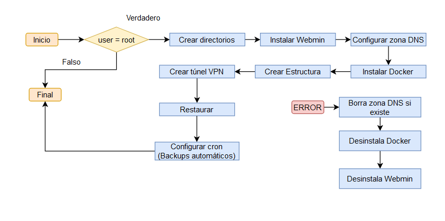

# MillionX project Creation


Para poder crear nuestra web desde cero:

```bash
# Haremos ejecutable el fichero main.sh
chmod +x main.sh
# Ejectuaremos el fichero main.sh para crear todo
./main.sh
```

Este script sigue la siguiente estructura:


